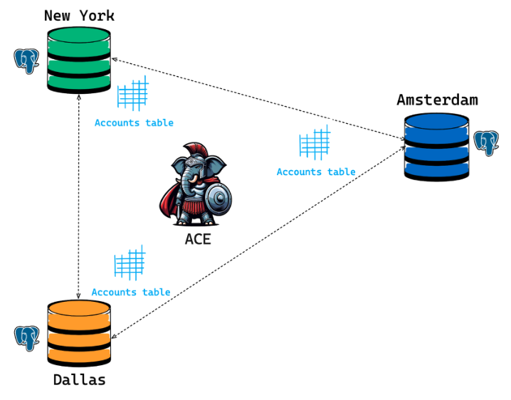

# ACE (the Active Consistency Engine)

In an eventually consistent system (like a cluster), nodes can potentially go out of sync (diverge) due to replication exceptions, replication lag, network partitions, or node failures. Node divergences can also arise out of planned maintenance windows or even unexpected cloud provider failures. The Active Consistency Engine (ACE) allows for reconciliation of such differences across databases by performing efficient node state comparisons and repairs in a highly controlled manner.

You can invoke ACE functions on the [command line](../docs/ace_functions.md), or from an [API endpoint](../docs/ace_api.md).  [Scheduling options](../docs/schedule_ace.md) in ACE make it convenient to run unmanned checks as part of routine maintenance to keep your  cluster healthy.

## Common Use Cases for ACE

**Node Failures:** When node outages happen -- whether planned or unplanned, they may result in a node-state divergence when the node eventually rejoins the cluster. ACE is a great tool for use in such cases; it can provide a report of the magnitude and the nature of the divergence, and also repair the node's state in a highly controlled manner.

**Network Partitions:** In a typical pgEdge Distributed Postgres deployment, a database cluster is often spread across multiple regions and data centers. Due to the volatility that comes with a large-scale deployment, link degradation and other network related issues are common. This volatility can result in Spock replication exceptions. You can use ACE to identify the precise set of affected records, and perform surgically precise repairs to ensure that a node is brought back to a consistent state, while causing little to no disruption to the application.

**Planned Maintenance:** During planned maintenance windows, a node can fall behind its peers. Even within a cluster, you can use ACE to rapidly bring the node back up to speed by configuring the repair to perform inserts and updates en masse.

**Post-Repair Verification:** You can use the ACE's rerun functionality to confirm if ACE has resolved previously identified diffs.

 **Confirm if Diffs Still Persist:** Use the rerun function to verify if diffs identified by table-diff still exist after a replication lag window has elapsed.

**Spock Exception Repair:** You can use repair functions to fix exceptions arising from insert/update/delete conflicts during replication.

**Network Partition Repair:** You can use repair functions to restore consistency across nodes after repairing a network partition.

**Temporary Node Outage Repair:** You can use repair functions to bring a cluster up to speed after a temporary node failure.
