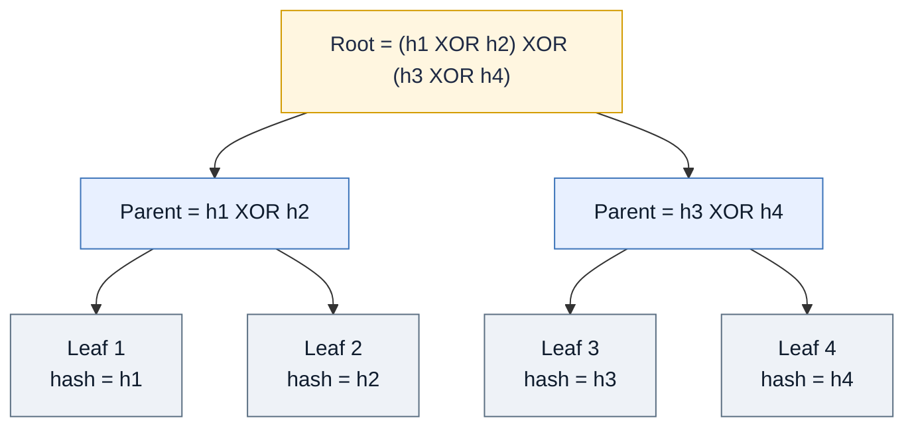
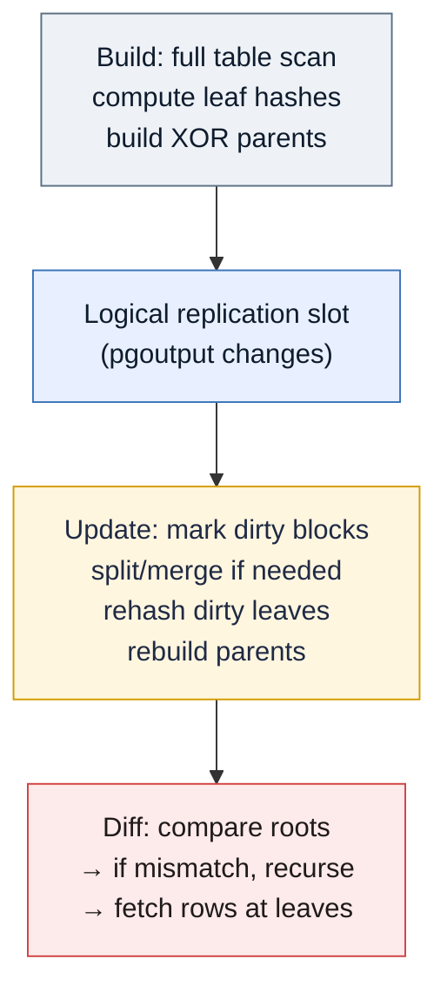
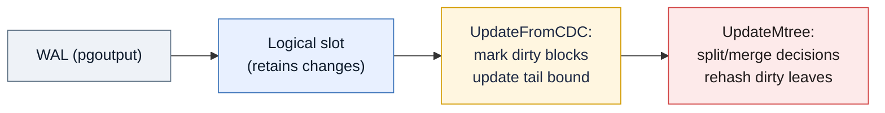
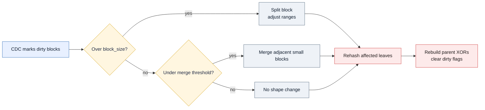
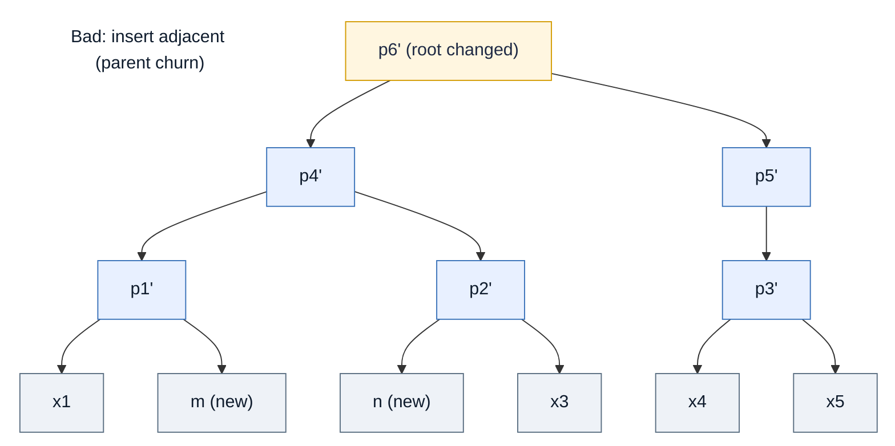
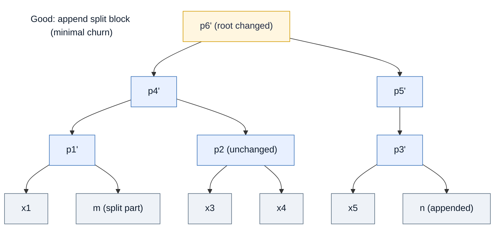
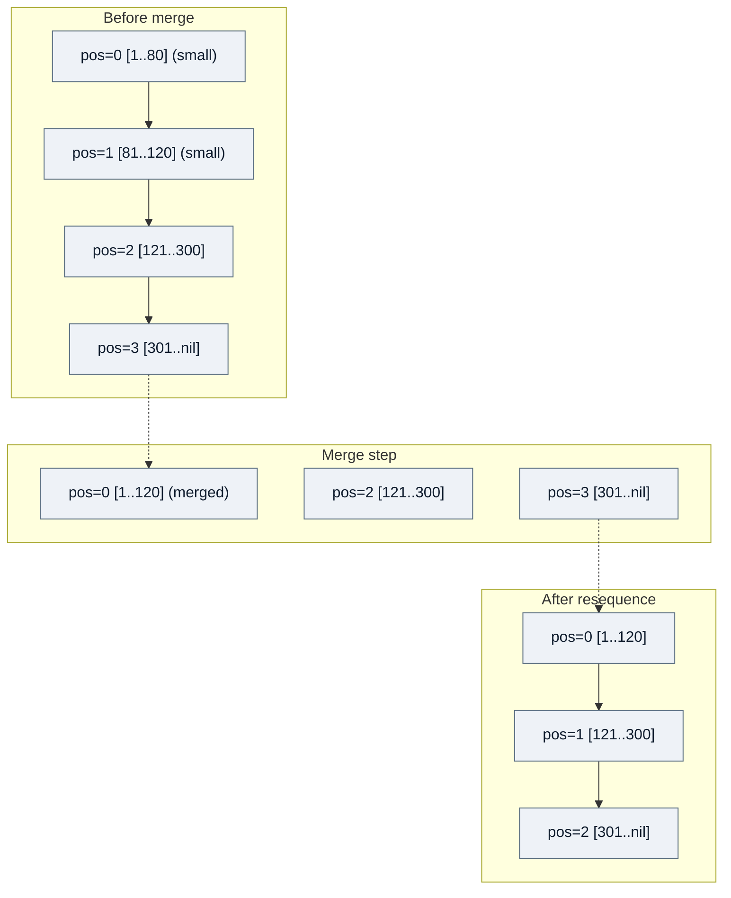
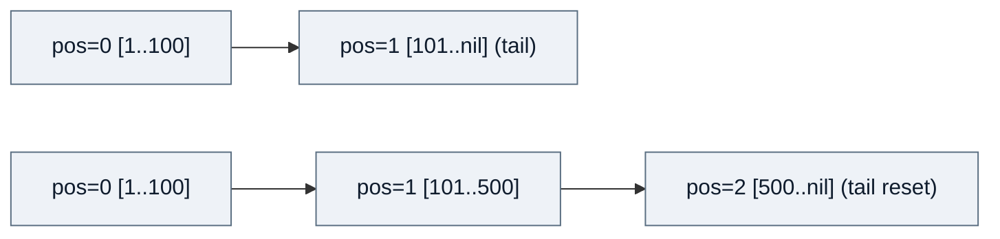
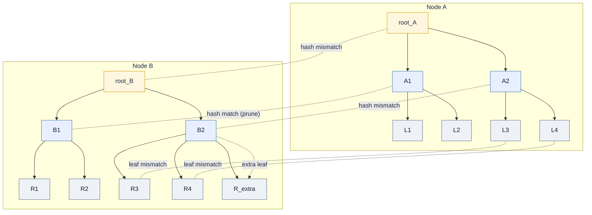
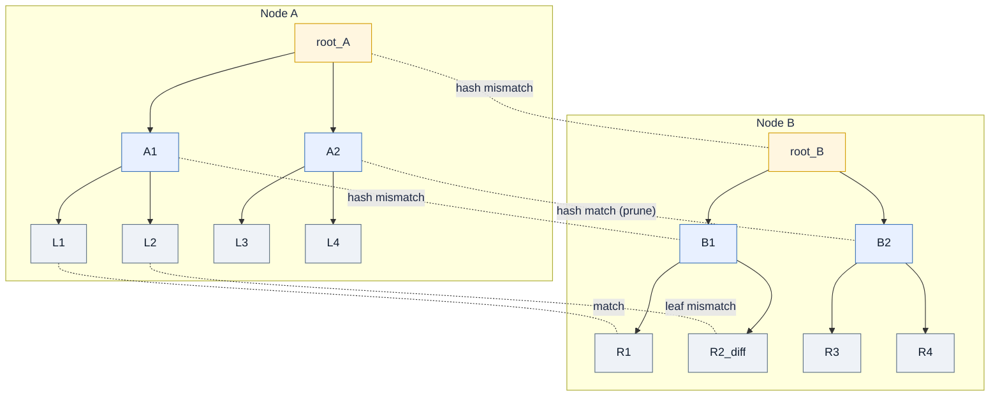

# Merkle Tree Architecture

Developing Merkle Trees for ACE is driven by the following requirements:

- Table-diff is efficient for one-off or infrequent checks, but rerunning it regularly recomputes block hashes across the entire table every time.
- When most data is unchanged, re-hashing every block is wasteful—especially on very large tables (think ~1 TB or ~1B rows) where hash scans dominate runtime and resource use.
- A Merkle tree lets us cache and reuse block hashes between runs. Unchanged subtrees are skipped; only branches covering modified rows are rehashed and compared, reducing I/O, CPU, and network load for recurring diffs.
- The goal is fast, incremental validation for operators who need frequent consistency checks without paying the full-block hashing cost each run.

## What Is a Merkle Tree?

- A Merkle tree is a hash tree: leaves hold hashes of data blocks; every internal node combines its children’s hashes into a parent hash. The root represents the entire dataset—if any leaf changes, all ancestors (and the root) change.
- ACE optimisation: parent nodes are computed as XORs of child hashes rather than hashing the concatenation. XOR is fast, associative, and easy to update incrementally when a child changes, making rebuilds cheaper for large trees.

## How Merkle Trees Work in ACE

- **Initial build (full scan once)**: ACE partitions the table into PK-ordered blocks (like table-diff) and computes leaf hashes for every block on each node—this is the only full-table scan. Parent hashes are built upward using XOR to form the root.
- **Change capture (pgoutput + replication slot)**: The table is added to a publication; pgoutput changes are streamed into a logical replication slot. ACE marks affected blocks as dirty based on PK ranges (no full re-scan).
- **Update step**: `UpdateMtree` reads accumulated changes from the slot, splits or merges blocks if needed, recomputes hashes only for dirty/new leaves, rebuilds parent XORs, and clears dirty flags. Block size is recovered from metadata to stay consistent with the build.
- **Diff step**: `DiffMtree` first runs an update (to fold recent changes into the tree), then traverses trees across nodes. Matching hashes at a node mean “skip subtree”; mismatches recurse until leaves are reached, where row-level diffs are fetched if required.

## CDC Pipeline and Dirty Block Detection

- **Capture**: Each node adds the table to a publication; pgoutput changes are streamed via a logical replication slot (see `UpdateFromCDC`). Inserts/deletes/updates are mapped to PK ranges; affected blocks are marked dirty—no rehash yet.
- **Persist**: The slot retains WAL until ACE consumes it; long delays can bloat WAL. Ensure slot retention is acceptable and the service role has replication/publication privileges.
- **Apply**: On `UpdateMtree`, ACE reads the slot, updates per-block counters/dirty flags, and resets `range_end` to NULL for the tail when new rows arrive past the last bound. Splits/merges are then decided from those dirty flags.
- **Options**: `--no-cdc` skips slot consumption (not recommended before a diff); `CDCProcessingTimeout` bounds how long ACE waits while applying changes.
- **User reminders**
  - Keep the slot healthy: monitor lag to avoid WAL buildup; drop/recreate only if you rebuild trees.
  - Run `update` before `diff` (ACE does this automatically for `diff`) so trees include recent changes.
  - Ensure the publication still includes the table and that the slot isn’t removed by maintenance.

## Updates: Why Splits and Merges Matter

- **Why split?** Hot ranges can grow far beyond the intended block size due to concentrated inserts (e.g., sequential PKs). Oversized blocks slow hashing and make diff localisation coarse. Splitting restores a balanced fan-out and keeps leaf work bounded.
- **Why merge?** Sparse/deleted ranges can shrink, leaving tiny blocks that add overhead with little data. Merging adjacent small blocks reduces hash tasks and tree depth.
- **Update flow:** During `UpdateMtree`, ACE identifies dirty/new blocks from CDC, then:
  1. Finds overfull blocks and splits them (with re-sequencing of node positions).
  2. Optionally merges underfull blocks if `Rebalance` is enabled.
  3. Rehashes only the affected leaves and rebuilds parents.
  4. Clears dirty flags so future updates skip unchanged blocks.

## Examples: Splitting and Merging Merkle Tree Nodes

- **Splitting**  
  - A split block is appended at the end (new `node_position = max + 1`) to avoid immediate parent-hash churn; afterward ACE re-sequences leaves by PK start so positions are contiguous for later maintenance.
  - Parent nodes are dropped and rebuilt after splits so XOR hashes reflect the new leaf layout.
  - Rationale: inserting the new block adjacent to the original would change hashes for every ancestor along that branch, forcing deeper traversal even though only two leaves changed. Appending preserves most parent-child hashes until the controlled rebuild, which limits needless tree churn.

- **Why adjacency hurts**  
  Inserting the split block next to the original forces a cascade of parent hash changes, so diff traversal cannot prune early.

- **Why appending helps**  
  Appending the new block leaves most parents intact; only the split branch and ancestors that include it change. Diff traversal prunes more quickly.

- **Merging**  
  - ACE merges a block with its immediate successor when their combined row count is under ~1.5× `block_size`. The merged block keeps the lower position; the successor is deleted. After each merge pass, positions are re-sequenced (same temp-offset trick) to keep positions contiguous for later splits/merges.
  - Parent nodes are dropped and rebuilt post-merge.
  - Re-sequencing uses a large temporary offset (1,000,000) to avoid position collisions during moves; this is safe up to ~100B rows, but is disruptive and can change parent-child relationships, so heavy rebalancing is recommended only when absolutely necessary and during maintenance windows.

### Additional Split/Merge Considerations

- **Open-ended last block handling**  
  - The trailing block often has `range_end = NULL` so new inserts beyond the current max PK land there. When splitting an unbounded block, ACE temporarily discovers a max PK to create a split point, then ensures the final leaf is unbounded again so future inserts keep hitting a single tail block. This prevents new rows from “falling off” the tree after a split.

- **Composite PK split points**  
  - For composite keys, split points are chosen using ordered tuples (`ROW(col1, col2, ...)`) at roughly the midpoint of the block’s row count. Bounds and inserts are bound component-wise. If a final “sliver” block would be too small, ACE drops the last split point to avoid creating a tiny trailing leaf.
  - Simple PKs pick a single midpoint value; composite PKs load and register the composite type so range updates and inserts stay consistent with the PK ordering.

- **Thresholds and rebalance guidance**  
  - Splits fire when a block grows beyond ~2× `block_size`; merges apply when neighbouring blocks together are under ~1.5× `block_size` (or ~25% thresholds in Python reference). This keeps leaf sizes within a sensible band.
  - Re-sequencing and parent rebuilds are cheap compared to leaf rehashing, but they do perturb parent-child relationships. Use heavy rebalancing (`--rebalance`) sparingly—ideally in maintenance windows—to avoid churn on hot tables.

## Diff Traversal Algorithm
- ACE compares Merkle trees across node pairs top-down. If root hashes match, the entire table is considered in sync. When a parent hash mismatches, ACE descends to its children; matching subtrees are pruned, mismatching subtrees recurse until leaves are reached. If leaves don’t align (one side has extra splits/merges), the extra leaves are treated as mismatches.
- Parent hashes are XORs of child hashes (fast to recompute). Leaf hashes are cryptographic hashes of table blocks; XOR collisions at parent levels are acceptable because leaf hashes still guard correctness.
- Edge cases:
  - **Unbalanced trees:** If one node split/merged more, traversal still walks each subtree; missing peers are flagged as mismatches.
  - **Early pruning:** Large identical subtrees are skipped after a single hash compare.
  - **Diff materialisation:** Only at mismatching leaves; ACE then fetches block rows and aligns by PK.

Notes:
- Traversal proceeds until leaves are aligned or exhausted; missing peers (extra leaves) are flagged.
- Parent XOR hashes speed pruning; leaf cryptographic hashes guard correctness.
- Diffs are materialised only at mismatching leaves, limiting database reads.
- In the unbalanced example above, the right-side tree has an extra leaf (`R_extra`). ACE descends until it exhausts matching parents; when it sees that `RB` has a child with no peer, it records that entire extra leaf as a mismatch (representing rows present only on Node B). Similarly, if Node A had more leaves, those would be marked as present-only-on-A. This ensures asymmetric splits/merges still surface as drift.

## Operational Details and Limits

- **Schema objects and lifecycle**: Build creates `ace_mtree_<schema>_<table>` plus a composite PK type when needed, metadata rows (block size, counts, timestamps), and adds the table to a publication/slot. Teardown drops these. Updates/diffs reuse the metadata; changing `block_size` requires a rebuild.
- **Block size reuse**: `UpdateMtree` reads block size from metadata; you cannot “resize” a tree via update. Rebuild if you need a different block size.
- **CDC drift and slot health**: If the logical slot is dropped or lags, WAL can bloat and trees become stale. Recover by rebuilding (init + build) and recreating the slot/publication entry. `--no-cdc` means you are diffing stale trees unless you run a rebuild first.
- **Rebalance caveats**: `--rebalance` re-sequences leaves with a large temp offset and rebuilds parents; this is disruptive to parent/child hashes and can slow subsequent diffs temporarily. Use it sparingly, ideally in maintenance windows.
- **XOR vs hash-of-hash**: Parent XORs are chosen for speed and incremental updates. Leaf hashes remain cryptographic; XOR parents are for pruning, not integrity on their own. Collisions at parent levels are extremely unlikely to hide a leaf difference because leaves are still compared directly on mismatch paths.
- **Mtree-specific tuning knobs**: `max_cpu_ratio` influences worker count and pool sizing; `batch_size` controls how many ranges are compared per DB round-trip in diffs. Higher values increase throughput but raise DB and network load.
- **Error handling**: If splits/merges or parent rebuilds fail (e.g., type issues, missing metadata), `update`/`diff` aborts; the remedy is usually to fix the schema/state and rerun, or rebuild the tree when metadata and actual table diverge.

### Observability and Teardown
- **Task records**: Mtree runs are recorded in `ace_tasks.db` (table `ace_tasks`) with context about block size, nodes, and statuses. Check logs for counts of dirty blocks, splits/merges applied, parent rebuilds, and extra-leaf mismatches during diff traversal.
- **Slot health**: Monitor logical slot lag/WAL retention; a bloated slot suggests `update` hasn’t consumed changes. If the slot is dropped or stale, rebuild (init + build) and recreate the slot/publication entry.
- **Teardown/reset**: Prefer the built-in `teardown`/`teardown-table` commands to remove mtree artifacts (mtree table, composite type, metadata, publication entry). Use manual drops only if automation fails, then rebuild with the desired block size and resume CDC.
