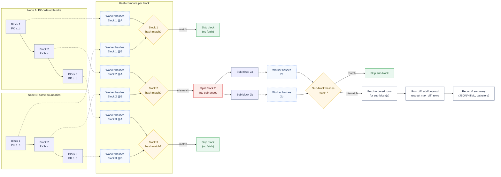
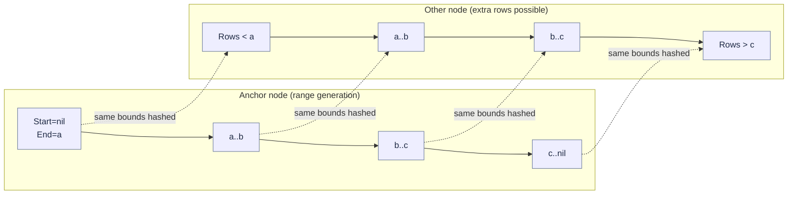
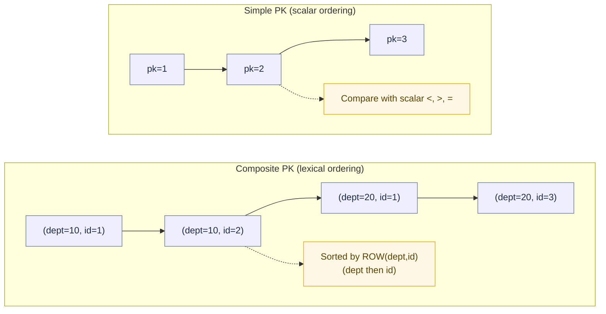

# Table Diff Architecture

The design of table diff is driven by the following requirements and constraints:

- Whether a table is kept consistent via logical replication, physical replication, backup/restore, or bulk copy, operators need a fast, low-impact way to verify that the replicas really match.
- Full-table comparisons that take hours are operationally risky (locks, lag, disk and network blow-ups). We need a method that scales down to quick “am I in sync?” checks and scales up to multi-billion-row tables without bringing the cluster to its knees.
- The outcome should be actionable: pinpoint what differs (adds/deletes/changes) rather than a binary “good/bad,” so remediation can be targeted.

## Existing Approaches and Their Limitations

- **Dump + file diff (e.g., `pg_dump` then `diff`)**
  - Pros: simple tooling, easy to script.
  - Limitations: requires extracting the entire table; dumps must be sorted or canonicalised to be diffable; produces huge intermediates; easily runs for hours on large tables; false positives from ordering/format differences.
- **Whole-table checksum**
  - Pros: single pass, compact result.
  - Limitations: still scans the whole table; a single checksum gives no locality of differences; any drift forces another full scan to localise; sensitive to scan order; changes during the scan can invalidate results.
- **Row-by-row comparison script**
  - Pros: can respect primary-key ordering and return precise differences.
  - Limitations: typically single-threaded and network-heavy; must stream or materialise the entire table; slow on wide rows; prone to timeouts and snapshot drift if not carefully managed; bespoke scripts vary in correctness and performance.

## Algorithm (Block-Hash Diff)

The table is partitioned into primary-key ranges (blocks). Identical block boundaries are applied on every node. Each range/node pair is hashed by parallel workers; only blocks whose hashes disagree are split further and, eventually, materialised for row-level diffing.



### Range Generation Without Full Scans

For very large tables we cannot afford `SELECT COUNT(*)` or `SELECT pk FROM table ORDER BY pk` to drive block boundaries; both imply full scans and can take hours.

- ACE uses planner estimates (`queries.GetRowCountEstimate`) to gauge table cardinality cheaply. This makes up-to-date statistics important—stale stats skew block sizing and sampling.
- For filtered diffs (materialized view), ACE performs a real `COUNT(*)` only on the filtered view, accepting the smaller scope to get accurate bounds.
- Based on the estimated row count, ACE chooses a sampling mode for `TABLESAMPLE` in `GeneratePkeyOffsetsQuery`:
  - Very large tables (100+ billion rows): `SYSTEM` with ~0.01%
  - Large tables (1–100 billion rows): `SYSTEM` with ~0.1%
  - Medium tables (100k–1 million rows): `BERNOULLI` ~1%
  - Smaller tables (10k–100k rows): `BERNOULLI` with a higher percentage (up to 100%)
- The sampled PKs are bucketed via `ntile` to yield start/end boundaries for each block. ACE also prepends a synthetic leading range (`Start=nil`) to ensure coverage from the absolute beginning, even if sampling misses tiny early values.

### Range Alignment Across Nodes

Challenge: block boundaries come from one anchor node (the one with the highest estimated row count). Other nodes may have rows that sort before the anchor’s first PK or after its last PK. If we only used closed intervals from the anchor, those edge rows would never be hashed.

- The offsets query (`GeneratePkeyOffsetsQuery`) always keeps the anchor’s first and last PKs and leaves the final range open (`End = NULL`). That makes the top end unbounded on every node, so “extra tail” rows are still included and hashed.
- `table-diff` injects a synthetic leading range with `Start = NULL` and `End = <first anchor boundary>` to catch rows that exist only before the anchor’s first PK on another node.
- Each range is applied identically to every node. In `hashRange`, `nil` means “no bound,” so the same logical ranges become open at the edges, letting boundary skew surface as hash mismatches.
- When hashes differ because of leading/trailing skew, recursion splits the offending range until the discrepant rows are isolated and, if needed, materialised.



### Comparison Notes: Simple vs Composite Primary Keys

- **Ordering and hashing**
  - Simple PK: ranges use scalar bounds; hashing binds one value for lower/upper when present.
  - Composite PK: ranges are tuples (`ROW(col1, col2, ...)`); hashing binds each component, and comparisons rely on the tuple sort order.
- **Range splitting**
  - Simple PK: median discovery and splits are straightforward using a single OFFSET/LIMIT on the ordered PK.
  - Composite PK: splits still pivot on PK order but must scan and bind every key component; more columns mean more bind parameters and slightly heavier queries.
- **Row materialisation**
  - `fetchRows` always orders by the PK columns (single or composite) so `CompareRowSets` can align rows deterministically.
  - Arrays/UDTs get cast to `TEXT` to avoid OID/scan issues regardless of PK shape.
- **What users should watch for**
  - Ensure the declared PK is the true business key; otherwise, composite drift can hide behind non-unique or misordered keys.
  - Keep statistics fresh so sampling and range sizing remain representative for multi-column distributions.
  - Avoid nullable or unstable key components (e.g., keys derived from timestamps that can change) to keep comparisons consistent over time.



### Resource Utilisation and Tuning

- **block_size**: Larger blocks reduce hash tasks and recursion but increase memory/IO per hash and slow mismatch localisation; smaller blocks do the opposite (more queries, finer locality).
- **concurrency_factor**: CPU ratio (0.0–4.0) that scales workers relative to `NumCPU` (e.g. 0.5 on a 16-CPU host spawns 8 workers). Higher = faster hashing but more load on DB backends, network, and local CPU; can contend with other workloads and connection limits.
- **compare_unit_size**: Lower values push recursion deeper (more queries, smaller fetches); higher values stop earlier (fewer queries, larger fetches on mismatched ranges).
- **max_diff_rows**: Early-exit guardrail. Lower caps keep runs short and reports small on divergent tables; raising/removing can grow memory and report size when drift is large.
- **table_filter**: Narrows scope and cost; enables accurate `COUNT(*)` on the filtered view. Must be identical across nodes to avoid false positives.
- **override_block_size**: Skips safety rails from `ace.yaml`. Oversized blocks can spike memory and slow hashes, especially on wide rows.
- **output (json/html)**: HTML adds minor post-processing; DB load is unaffected.

### Failure Modes and Safeguards

- **Diff limit hit**: `max_diff_rows` stops recursion early and marks the report; more differences may exist.
- **Permission or schema/PK mismatch**: Validation fails before work starts; nothing is executed against the DB.
- **Bytea >1 MB**: `CheckColumnSize` aborts to avoid runaway memory/IO.
- **Timeouts/slow ranges**: Hashing is wrapped in timeouts; the first error is recorded and surfaced after workers finish.
- **Stale stats**: Skewed row-count estimates can mis-size blocks; rerun `ANALYZE` for better sampling.

### Consistency Caveats
- No cross-node snapshot coordination. Concurrent writes during a run can appear as drift.
- Prefer quiescent windows or use `table_filter` to target stable partitions.
- PK stability matters: changing PK values mid-run can reshuffle ordering and produce noisy diffs.

### Operational Tuning Playbook

- Start conservative on busy systems: smaller `concurrency_factor`, moderate `block_size`.
- For large but mostly consistent tables: increase `block_size` and `concurrency_factor` to hash faster; keep `compare_unit_size` reasonable to localise mismatches.
- For drift-heavy tables: lower `block_size`/`compare_unit_size` to localise quickly; keep `max_diff_rows` low to bound runtime and report size.
- After stats refresh or schema changes, re-evaluate sampling and block sizing.

### Limits and Edge Cases

- Requires a declared PK; up to three-way diffs only.
- `table_filter` creates per-node materialized views; filters must match exactly across nodes.
- Sampling can under-represent skewed PK distributions; synthetic leading/open ranges and recursive narrowing mitigate, but extreme skew may need smaller blocks.
- Wide JSON/bytea/UDT columns increase hash and fetch cost; oversized bytea (>1 MB) blocks execution.

### Observability

- Logs show range hashing progress, mismatches, recursion, and diff limits.
- Progress bars (mpb) reflect hash and mismatch-analysis stages.
- Task status and summary are persisted to SQLite (`ace_tasks.db` by default, or the `ACE_TASKS_DB` path) via `taskstore` in table `ace_tasks` with columns: `task_id`, `task_type`, `task_status`, `cluster_name`, `task_context` (JSON), `schema`, `table_name`, `repset_name`, `diff_file_path`, `started_at`, `finished_at`, `time_taken`. Example rows:

  | task_id       | task_status | cluster | schema | table_name       | diff_file_path                                      | started_at           | finished_at          | time_taken | task_context (truncated)                                                                                  |
  |---------------|-------------|---------|--------|------------------|------------------------------------------------------|----------------------|----------------------|------------|-----------------------------------------------------------------------------------------------------------|
  | 9f7f…e21b     | COMPLETED   | acctg   | public | customers_large  | public_customers_large_diffs-20250722120353.json    | 2025-07-22T12:03:51Z | 2025-07-22T12:03:53Z | 2.1        | {"qualified_table":"public.customers_large","mode":"diff","nodes":"all","diff_summary":{...}}            |
  | 3b2c…9aa4     | FAILED      | acctg   | public | orders           |                                                      | 2025-07-21T10:15:00Z | 2025-07-21T10:15:08Z | 8.0        | {"qualified_table":"public.orders","mode":"diff","nodes":"n1,n2","error":"user \"replicator\" lacks…"}   |
  | 1a4d…c7f2     | COMPLETED   | acctg   | public | invoices         | public_invoices_diffs-20250720115900.json           | 2025-07-20T11:58:55Z | 2025-07-20T11:59:00Z | 5.0        | {"qualified_table":"public.invoices","mode":"diff","nodes":"n1,n2","table_filter":"billing_cycle = …"}   |

- Diff reports write to timestamped JSON (and HTML if selected); paths are logged on completion.
- Sample analytics (SQLite):

  - Recent table-diff runs:
    ```sql
    SELECT task_id, task_status, started_at, finished_at, time_taken, diff_file_path
    FROM ace_tasks
    WHERE task_type = 'TABLE_DIFF'
    ORDER BY started_at DESC
    LIMIT 20;
    ```

  - Success/fail counts over the last 7 days:
    ```sql
    SELECT task_status, COUNT(*)
    FROM ace_tasks
    WHERE task_type = 'TABLE_DIFF'
      AND started_at >= datetime('now','-7 day')
    GROUP BY task_status;
    ```

  - Drift summary by run (JSON fields from `task_context.diff_summary`):
    ```sql
    SELECT
      task_id,
      json_extract(task_context, '$.diff_summary.total_rows_checked')   AS rows_checked,
      json_extract(task_context, '$.diff_summary.mismatched_ranges_count') AS mismatched_ranges,
      json_extract(task_context, '$.diff_summary.diff_row_limit_reached')  AS limit_hit
    FROM ace_tasks
    WHERE task_type = 'TABLE_DIFF'
    ORDER BY started_at DESC
    LIMIT 20;
    ```
