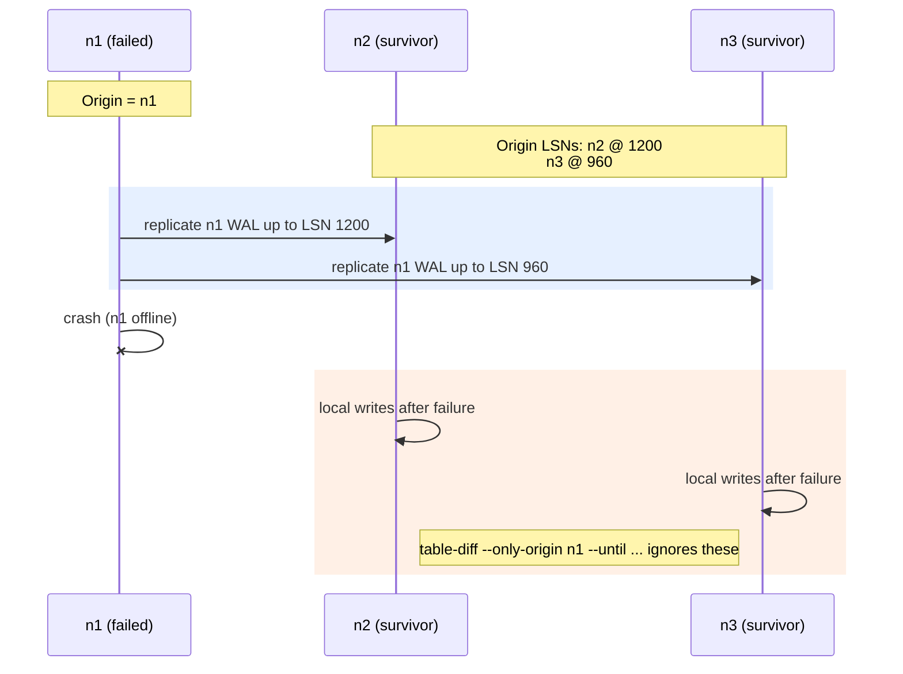

# Using ACE for Catastrophic Node Failure (CNF) Recovery

Catastrophic node failures leave a cluster with one node abruptly down mid‑replication. The failed node’s transactions may be partially replicated; survivors can drift. ACE helps you scope and repair that drift by focusing on the failed node’s origin and a known cutoff, then repairing from the best survivor.

## A concrete scenario (human-readable LSNs)
- Note: LSN numbers below are illustrative, not PostgreSQL-accurate.
- Nodes: `n1` (failed), `n2`, `n3` (survivors).
- At failure time:
  - `n2` had applied `n1`’s WAL up to **LSN 1200**.
  - `n3` had applied `n1`’s WAL up to **LSN 960**.
- After failure, `n2` and `n3` keep accepting their own writes. For recovery, you only want to reconcile rows whose origin is `n1` and whose commit timestamp is at or before the failure.

Sequence snapshot (origin = n1; post-failure writes ignored by origin-only diff):


Key idea: scope the diff to `node_origin = n1` and fence at the last trusted commit time/LSN, then repair from the survivor with the furthest origin LSN (here, n2).

## Step-by-step commands

1) **Origin-scoped diff on survivors**  
   Run from an admin host that can reach the survivors:
   ```sh
   ./ace table-diff \
     --nodes n2,n3 \
     --only-origin n1 \
     --until 2025-12-12T16:00:00Z \
     --output json \
     mycluster public.customers
   ```
   - `--only-origin n1` limits rows to those whose `node_origin` is `n1`.
   - `--until` fences at the last trusted commit from the failed node (timestamp or LSN converted to timestamp).
   - The diff summary records `only_origin`, `only_origin_resolved`, `until`, `table_filter`, and `effective_filter`.

2) **Recover with `table-repair`**  
   Use the diff file produced above. In recovery-mode, ACE **by default** probes survivors for the failed node’s Spock origin LSN (preferred) and slot LSN (fallback) and auto-picks the survivor with the highest LSN as source of truth. Ties or missing LSNs require an explicit `--source-of-truth`.
   ```sh
   ./ace table-repair \
     --diff-file=public_customers_diffs-20251212160000.json \
     --nodes n2,n3 \
     --recovery-mode \
     mycluster public.customers
   ```
   Recovery-mode rules:
   - If the diff is origin-only, `table-repair` refuses to run without `--recovery-mode`.
   - Default: query origin LSN; if absent, slot LSN; pick the highest. Ties/missing → provide `--source-of-truth`.
   - Reports include the chosen source and the LSN probes.

   If you want to override SoT explicitly:
   ```sh
   ./ace table-repair \
     --diff-file=public_customers_diffs-20251212160000.json \
     --nodes n2,n3 \
     --recovery-mode \
     --source-of-truth n2 \
     mycluster public.customers
   ```

   Optional: apply a plan (e.g., upsert-only) in recovery-mode:
   ```sh
   ./ace table-repair \
     --diff-file=public_customers_diffs-20251212160000.json \
     --nodes n2,n3 \
     --recovery-mode \
     --repair-file=plan.yaml \
     mycluster public.customers
   ```

3) **Validate convergence**  
   Re-run `table-diff` without `--only-origin` (or with it) to ensure survivors agree:
   ```sh
   ./ace table-diff \
     --nodes n2,n3 \
     --output json \
     mycluster public.customers
   ```

## Tips and cautions
- Pick a defensible `--until` cutoff: the failed node’s last confirmed commit time (or convert its last LSN to a timestamp).
- If LSNs are missing on survivors, auto SoT selection will fail; provide `--source-of-truth`.
- Advanced plans are allowed in recovery-mode; use them for upsert-only/coalesce patterns instead of default delete/update behavior.
- For large tables, combine `--table-filter` with `--only-origin` and iterate in chunks.
